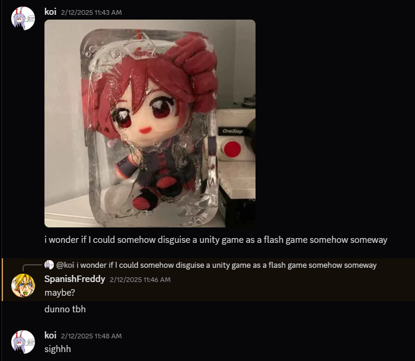

# UniHider

A way to hide that your games use Unity!

I honestly only made this because I wondered if I could disguise a Unity game as a Flash Game :D



## How to use

1. First you zip your executable and data folder and add a password to it (I RECOMMEND USING 7ZIP AND ITS ZIPCRYPTO ENCRYPTION METHOD).

2. Then rename the zip to any format that you want. (.bin, .dat, etc.)

3. The go into main.cpp and change the file name to the zip that you want to use and change the password.

4. Then compile UniHider and put the unity game zip in the same folder as the executable.

5. Then run UniHider and it'll extract the zip into a hidden ram drive and run the executable!

## How to compile

1. Download vcpkg:

```
git clone https://github.com/Microsoft/vcpkg.git
cd vcpkg
bootstrap-vcpkg.bat
vcpkg install libzip:x64-windows
vcpkg integrate install
```

2. Then open UniHider.sln in Visual Studio and compile it.